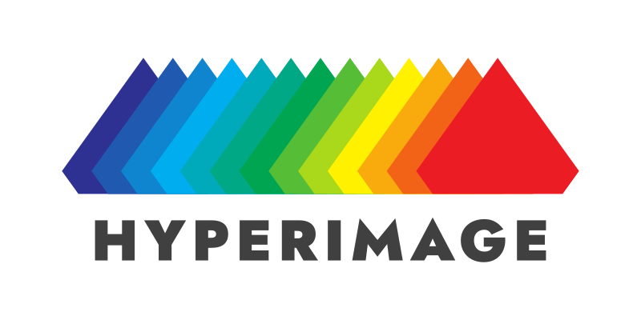

# A universal spectral imaging sensor platform for industry, agriculture, and autonomous driving

<!--  -->

<b>HyperImage’s main goal</b>

The HyperImage project aims to create an image sensing platform that revolutionizes spectral imaging technology for both short and long-range applications. With a focus on universality, speed, and affordability, the project endeavors to develop modular and adaptable photonic components and software solutions alongside high-performance spectral imaging sensors. These innovations aim to enhance resolution, widen wavelength ranges, and ultimately reduce costs, opening doors to previously inaccessible realms of imaging technology. Through a strategic focus on technical objectives, HyperImage seeks to develop modular, adaptable, and cost-effective photonic components and high-performance spectral imaging sensors.

