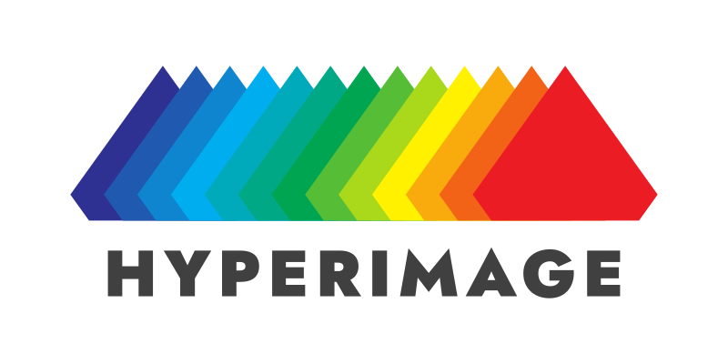
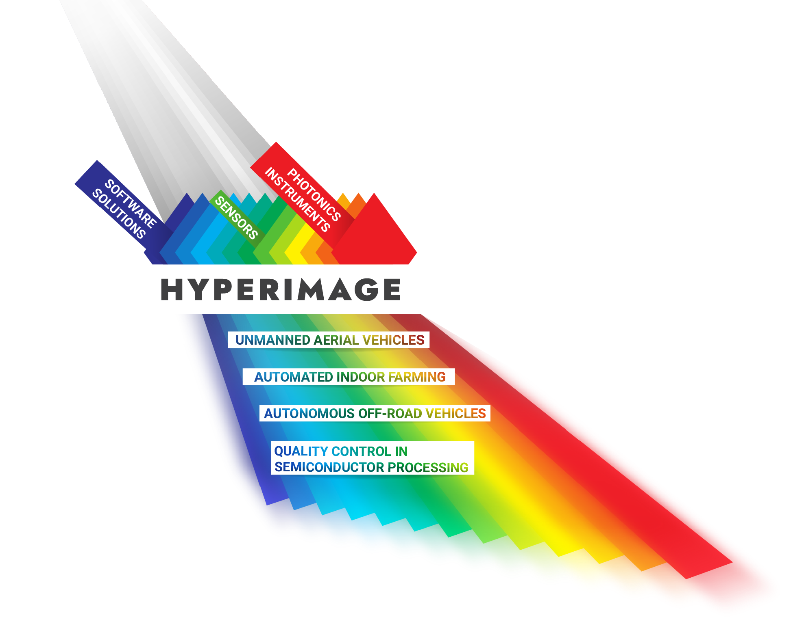

# A universal spectral imaging sensor platform for industry, agriculture, and autonomous driving

<!--  -->

<b>HyperImage’s main goal</b>

<!-- The HyperImage project aims to create an image sensing platform that revolutionizes spectral imaging technology for both short and long-range applications. With a focus on universality, speed, and affordability, the project endeavors to develop modular and adaptable photonic components and software solutions alongside high-performance spectral imaging sensors. These innovations aim to enhance resolution, widen wavelength ranges, and ultimately reduce costs, opening doors to previously inaccessible realms of imaging technology. Through a strategic focus on technical objectives, HyperImage seeks to develop modular, adaptable, and cost-effective photonic components and high-performance spectral imaging sensors. -->

The HyperImage project’s main objective is to develop a **universal, fast, and cost-effective spectral imaging platform** suitable for both long-range and short-range applications. The specific technical goals include developing innovative photonic components and high-performance spectral imaging sensors, creating advanced tunable optics, implementing modular design for automated material analysis and quality control, integrating lightweight and cost-effective spectral imaging modules into robots and vehicles, and establishing a cloud-based spectral image analysis platform. Ultimately, the project aims to validate and deploy the technology in diverse industrial use cases and establish commercialization routes and European value chains for spectral imaging systems across key market segments.

<!--  -->

| **DEVELOPMENT OF ADVANCED SPECTRAL IMAGING TECHNOLOGY** | **COMPREHENSIVE SYSTEM INTEGRATION AND APPLICATION** | **WIDE-RANGING INDUSTRIAL APPLICATION AND MARKET IMPACT** |
|----------------------------------------------------------|------------------------------------------------------|-----------------------------------------------------------|
| Create a universal, fast, and cost-effective spectral imaging platform suitable for both short-range and long-range applications. Develop innovative photonic components and high-performance spectral imaging sensors, reducing system costs by up to 60%. Implement fast, electrically switchable optical systems to enhance field of view, reduce system weight, and enable zoom applications. | Deliver a modular, complete system solution for both standalone analysis and fully integrated image recognition systems. Develop standalone desktop spectral imaging systems for automated material analysis and quality control, and lightweight modules for integration into robots and vehicles. Establish a cloud-based image analysis platform for real-time data processing, storage, and analysis. | Validate and deploy the technology in diverse industrial use cases, including semiconductor manufacturing, agriculture, autonomous vehicles, and reconnaissance drones. Establish commercialization routes and European value chains, aiming for widespread adoption in key market segments. Demonstrate the technology's potential to significantly improve efficiency, accuracy, and sustainability across multiple industries. |
